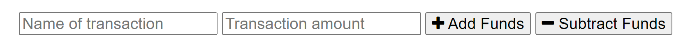

# Budget Tracker

This is the repository for the Budget Tracker PWA.

## Table of Contents

[Description](#description)  
[Installation](#installation)  
[How it works](#how-it-works)  
[Usage](#usage)  
[Utilizes](#utilizes)  
[Credits](#credits)  
[Questions](#questions)  
[License](#license)

## Description

Budget Tracker was designed to help users visualize their expenses over time.

This app served as an excellent primer to PWAs and the numerous benefits they provide.

On that note, the application is characterized by three main features:

- Users can record expenses through the app's minimalist and user-friendly UI.
- Budget data is displayed in both column and graphical format.
- Application utilizes Service Worker and IndexedDB for offline functionality.

## Installation

Installation is not required to use this app; simply follow the link below to access the deployed application.

However, users have the option to install the application. Follow the instructions in the proceeding section to do so.

## How it works

My primary focus was building a fully-fledged PWA with offline functionality; with that in mind, the rest of the application is fairly lean. The UI is minimalist, and only three Express.js routes were necessary to access/modify the database, which consists of one table.

Usage is straightforward. Simply enter your transaction name and amount in the appropriate input boxes, and then hit the "Add Funds" button.

The highlight of the application is its offline capability. Users can submit transactions in the absence of internet connectivity thanks to IndexedDB's caching functionality. Additionally, all front-end assets are cached using Service Worker.

Users also have the capability to install the application locally, thanks to the project's manifest.json file. To install, simply click the appropriate icon in the browser's navigation bar:

## Utilizes

- JavaScript
- Node.js
- Express
- MongoDB
- Mongoose

## Questions

Feel free to shoot me any questions at the email below:

rrich.kray.93@gmail.com

find my GitHub profile by following the link below:

https://github.com/rrich-kray/

## License

Copyright (c) 2022, Ryan Kray
All rights reserved.

This source code is licensed under the BSD-style license found in the LICENSE file in the root directory of this source tree and reproduced below.

Redistribution and use in source and binary forms, with or without modification, are permitted provided that the following conditions are met:

1. Redistributions of source code must retain the above copyright notice, this list of conditions and the following disclaimer.
2. Redistributions in binary form must reproduce the above copyright notice, this list of conditions and the following disclaimer in the documentation and/or other materials provided with the distribution.
3. All advertising materials mentioning features or use of this software must display the following acknowledgement: This product includes software developed by Ryan Kray.
4. Neither the name of this application's developer nor the names of its contributors may be used to endorse or promote products derived from this software without specific prior written permission.

THIS SOFTWARE IS PROVIDED BY THE COPYRIGHT HOLDER ''AS IS'' AND ANY EXPRESS OR IMPLIED WARRANTIES, INCLUDING, BUT NOT LIMITED TO, THE IMPLIED WARRANTIES OF MERCHANTABILITY AND FITNESS FOR A PARTICULAR PURPOSE ARE DISCLAIMED. IN NO EVENT SHALL THE COPYRIGHT HOLDER OR CONTRIBUTORS BE LIABLE FOR ANY DIRECT, INDIRECT, INCIDENTAL, SPECIAL, EXEMPLARY, OR CONSEQUENTIAL DAMAGES (INCLUDING, BUT NOT LIMITED TO, PROCUREMENT OF SUBSTITUTE GOODS OR SERVICES; LOSS OF USE, DATA, OR PROFITS; OR BUSINESS INTERRUPTION) HOWEVER CAUSED AND ON ANY THEORY OF LIABILITY, WHETHER IN CONTRACT, STRICT LIABILITY, OR TORT (INCLUDING NEGLIGENCE OR OTHERWISE) ARISING IN ANY WAY OUT OF THE USE OF THIS SOFTWARE, EVEN IF ADVISED OF THE POSSIBILITY OF SUCH DAMAGE.
